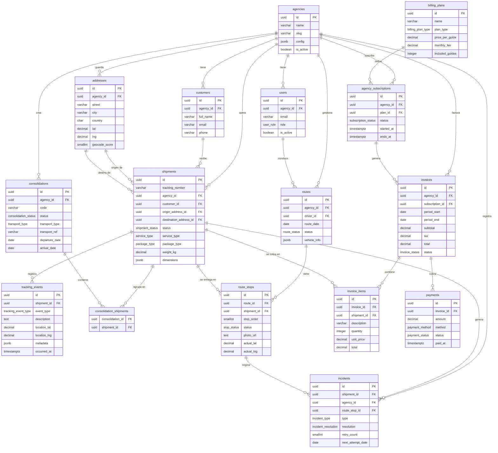

# Diseño de Base de Datos — Logística Shipments

## Decisiones Arquitectónicas

### Motor: PostgreSQL 15+
- JSONB nativo para datos flexibles (dimensiones, configuración, metadata de eventos)
- `pg_trgm` para autocompletado de direcciones con búsqueda difusa
- UUIDs como PKs: evita enumeración de IDs en la API pública y facilita sistemas distribuidos
- `TIMESTAMPTZ` en todos los campos de tiempo: operación en dos países (EE.UU. / México)

### Multi-tenancy: Shared Schema + `agency_id`
Todas las tablas operativas incluyen `agency_id`. El aislamiento se implementa a nivel de aplicación con filtros obligatorios, y puede reforzarse con Row Level Security (RLS) de PostgreSQL en producción.

**Ventajas sobre schemas separados:**
- Migraciones simples (un solo `ALTER TABLE`)
- Queries de reporte cross-agency para el admin global
- Sin overhead de gestión de conexiones por schema

### Append-Only: `tracking_events`
Los eventos de tracking son inmutables por diseño. Se bloquean `UPDATE` y `DELETE` con reglas de PostgreSQL. Esto garantiza trazabilidad completa y cumple con requisitos de auditoría futura.

### Máquina de Estados: `shipments.status`

```
captured
   │
   ▼
received          ←── recibido físicamente en bodega EE.UU.
   │
   ▼
in_transit        ←── asignado a un lote (consolidation)
   │
   ▼
in_route          ←── asignado a ruta de última milla
   │         │
   ▼         ▼
delivered  failed ──► returned
                 └──► in_route (reintento)
```

Transiciones permitidas:
| Desde        | Hacia                          |
|-------------|-------------------------------|
| captured    | received, cancelled            |
| received    | in_transit, cancelled          |
| in_transit  | in_route, cancelled            |
| in_route    | delivered, failed              |
| failed      | in_route (reintento), returned |

---

## Diagrama ERD



---

## Tabla de Entidades

| Tabla                    | Propósito                                        | Fase |
|--------------------------|--------------------------------------------------|------|
| `agencies`               | Tenants del sistema (ej. Manzanillo Express)     | MVP  |
| `users`                  | Todos los usuarios con sus roles                 | MVP  |
| `addresses`              | Direcciones origen (EE.UU.) y destino (MX)       | MVP  |
| `customers`              | Destinatarios finales de los envíos              | MVP  |
| `shipments`              | **Entidad central** — cada guía generada         | MVP  |
| `tracking_events`        | Log inmutable de eventos por envío               | MVP  |
| `consolidations`         | Lotes de mercancía para envío consolidado        | F2   |
| `consolidation_shipments`| Pivot lote ↔ envío                               | F2   |
| `routes`                 | Rutas de última milla por día y chofer           | F2   |
| `route_stops`            | Paradas ordenadas dentro de una ruta             | F2   |
| `incidents`              | Incidencias: fallo, dirección incorrecta, etc.   | F2   |
| `billing_plans`          | Planes de cobro (por guía, mensual, híbrido)     | F1   |
| `agency_subscriptions`   | Suscripción activa de cada agencia               | F1   |
| `invoices`               | Facturas por período                             | F1   |
| `invoice_items`          | Líneas de detalle de cada factura                | F1   |
| `payments`               | Pagos aplicados a facturas                       | F1   |
| `system_config`          | Configuración clave-valor global o por agencia   | MVP  |

---

## Estrategia de Índices

| Tabla              | Índice                              | Justificación                                      |
|--------------------|-------------------------------------|----------------------------------------------------|
| `users`            | `(agency_id)`                       | Filtro principal en todos los queries              |
| `shipments`        | `(agency_id)`, `(status)`           | Dashboard y filtros de estado                      |
| `shipments`        | `(tracking_number)`                 | Tracking público por guía                          |
| `shipments`        | `(created_at DESC)`                 | Lista paginada más recientes primero               |
| `tracking_events`  | `(shipment_id)`, `(occurred_at DESC)`| Timeline por envío                                |
| `addresses`        | `(lat, lng)` parcial               | Queries geoespaciales de optimización de rutas     |
| `addresses`        | `GIN trigram (street)`              | Autocompletado de direcciones                      |
| `routes`           | `(driver_id)`, `(route_date DESC)` | App del chofer: ruta del día                       |
| `incidents`        | `(resolution)`                      | Filtrar pendientes de resolución                   |

---

## Campos JSONB

| Tabla         | Campo          | Estructura esperada                                        |
|---------------|----------------|------------------------------------------------------------|
| `agencies`    | `config`       | `{"custom_statuses": [], "service_types": [], "branding": {}}` |
| `shipments`   | `dimensions`   | `{"width_cm": 30, "height_cm": 20, "depth_cm": 15}`       |
| `routes`      | `vehicle_info` | `{"plate": "ABC123", "model": "Sprinter", "color": "blanco"}` |
| `tracking_events` | `metadata` | Libre — foto_url, firma, coordenadas del chofer, etc.      |
| `system_config` | `value`      | Cualquier valor serializable según la clave                |

---

## Número de Guía

Formato: `LOG-YYYYMM-XXXXXXXX`

- Ejemplo: `LOG-202601-A4KR8NP2`
- Generado automáticamente por la función `generate_tracking_number()`
- Caracteres: alfanumérico sin ambiguos (sin `0`, `O`, `I`, `1`)
- Colisión: probabilidad ~1 en 33^8 ≈ 1 en 1.35 billones por mes

---

## Consideraciones de Seguridad

- `password_hash`: bcrypt con cost factor ≥ 12. Nunca almacenar texto plano.
- Tracking público (`/t/{tracking_number}`): endpoint sin auth, solo expone estado y eventos sin PII.
- RLS (Row Level Security) de PostgreSQL: activar en producción usando `agency_id` del JWT como variable de sesión para aislamiento a nivel de base de datos.
- Campos `photo_url` y `signature_url` en `route_stops`: almacenar en S3/blob storage, la DB solo guarda la URL firmada.

---

## Extensiones Futuras

| Módulo                  | Cambio de esquema                                               |
|-------------------------|-----------------------------------------------------------------|
| Score de dirección      | Columna `reliability_score` en `addresses`                     |
| Score de zona           | Nueva tabla `zone_scores(zone_geom, score, updated_at)`        |
| Integración FedEx/DHL   | Nueva tabla `external_carrier_events(shipment_id, carrier, raw_payload)` |
| Chat IA para reenvíos   | Nueva tabla `ai_conversations(incident_id, messages JSONB)`     |
| Geocoding avanzado      | Columna `geom GEOMETRY(Point, 4326)` en `addresses` con PostGIS |
